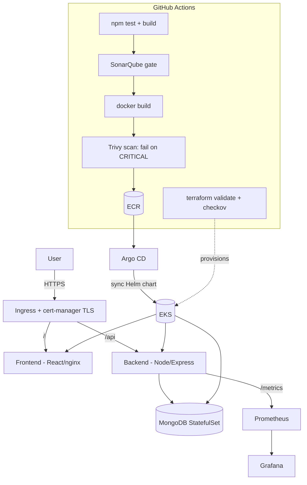

# 01 · Three-Tier DevSecOps Application on AWS EKS (flagship)

The full production lifecycle on one real **three-tier app** (React → Node.js →
MongoDB): infrastructure as code, a CI pipeline with **security gates**, GitOps
delivery, ingress + TLS, and monitoring.

> **Inspiration & credit:** [`AmanPathak-DevOps/End-to-End-Kubernetes-Three-Tier-DevSecOps-Project`](https://github.com/AmanPathak-DevOps/End-to-End-Kubernetes-Three-Tier-DevSecOps-Project).
> This is an independent rebuild with my own app (a todo service), my own Helm
> chart and Terraform, Trivy/SonarQube gates, and an all-local validation path so
> the whole thing is reviewable without an AWS bill.

> ⚠️ **Cost safety:** the Terraform here is **validated only** in CI and locally
> (`terraform validate`, no apply). Standing up real EKS + NAT + nodes costs
> money — **don't `terraform apply` without intending to pay**, and run
> `terraform destroy` when done.

## Architecture



## Components

| Layer | Tech | Path |
|-------|------|------|
| Frontend | React (Vite) → nginx-unprivileged | `frontend/` |
| Backend | Node.js / Express + Prometheus metrics | `backend/` |
| Data | MongoDB | (Helm `StatefulSet`) |
| Infra | Terraform: VPC + EKS + ECR (official modules) | `terraform/` |
| Delivery | Helm chart + Argo CD Application | `helm/`, `argocd/` |
| CI | GitHub Actions: test → Sonar → Trivy → (ECR) | `.github/workflows/devsecops-eks.yml` |

## Security gates (what fails the build)

| Gate | Tool | Blocks on |
|------|------|-----------|
| SAST | SonarQube | quality gate (runs when `SONAR_TOKEN` is set) |
| Image CVEs | Trivy | fixable **CRITICAL** vulnerabilities |
| IaC | Checkov | informational here (hard-gated in project `04`) |
| Pod hardening | chart | non-root, drop ALL caps, read-only rootfs, seccomp |

## Run / validate

```bash
# App locally
cd backend && npm install && npm test
cd ../frontend && npm install && npm run build

# IaC (validate only — no AWS account needed)
cd terraform && terraform init -backend=false && terraform validate

# Manifests
helm lint helm
helm template t helm | kubeconform -strict -ignore-missing-schemas -
```

## Provision EKS (only when you mean to pay)

```bash
cd terraform
# configure remote state in backend.tf first
terraform init && terraform apply          # creates VPC + EKS + ECR
aws eks update-kubeconfig --name three-tier-dev --region us-east-1
# install Argo CD, then:
kubectl apply -f ../argocd/project.yaml -f ../argocd/application.yaml
```

## Teardown / cost safety

```bash
terraform destroy        # remove EKS, NAT GW, nodes — stops all spend
```

Free path: everything except `terraform apply` runs locally for free (the app on
kind, manifests validated). Only the real EKS provision incurs cost.
