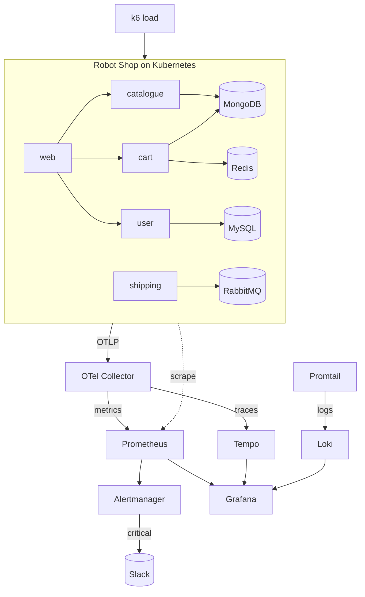

# 02 · Production Observability for Stan's Robot Shop

Full-stack **observability and SRE** on a real polyglot microservices app:
metrics, logs, traces, SLOs, burn-rate alerting — plus a reproducible
**injected-fault incident with a postmortem**.

> **Inspiration & credit:** [`instana/robot-shop`](https://github.com/instana/robot-shop)
> — Stan's Robot Shop, a purpose-built microservices monitoring sandbox
> (Node.js, Java, Python, Go, PHP + MongoDB, Redis, MySQL, RabbitMQ). This project
> is an independent **observability layer** on top of it: dashboards-as-code,
> promtool-tested SLO alerts, OTel→Tempo tracing, Loki logs, a k6 load profile,
> and an incident write-up — the "make it your own" upgrades the upstream lacks.

## Architecture



## What's here

| Path | Purpose |
|------|---------|
| `robot-shop/values.yaml` | Pinned values for the upstream Robot Shop Helm chart |
| `monitoring/prometheus/rules/` | Recording rules + **SLO/burn-rate alerts** |
| `monitoring/prometheus/tests/` | **promtool unit tests** (incl. the injected fault) |
| `monitoring/alertmanager/` | Routing to Slack + inhibition rules |
| `monitoring/grafana/dashboards/` | Golden-signals + SLO/error-budget dashboards (JSON) |
| `monitoring/otel/` `tempo/` `loki/` | Tracing + log pipelines |
| `monitoring/kube-prometheus-stack.values.yaml` | Helm values for the metrics stack |
| `load/k6-loadtest.js` | Traffic generator |
| `incident/` | Injected-fault postmortem |

## SLOs

| SLO | Target | Alert |
|-----|--------|-------|
| Availability | 99.9% success | `HighErrorRate` (>5%/5m), `ErrorBudgetBurnFast` (14.4× over 1h+5m) |
| Latency | p99 < 1s | `HighLatencyP99` |
| Liveness | targets up | `ServiceDown` |

The burn-rate alert follows the Google SRE multi-window method. Every alert is
**unit-tested** — `promtool test rules` feeds synthetic fault metrics and asserts
the alert fires with the right labels/annotations.

## Deploy (local kind)

```bash
kind create cluster --name robotshop

# 1. metrics stack
helm repo add prometheus-community https://prometheus-community.github.io/helm-charts
helm install kps prometheus-community/kube-prometheus-stack \
  -n monitoring --create-namespace -f monitoring/kube-prometheus-stack.values.yaml

# 2. our SLO rules (wraps the tested rule files into a PrometheusRule)
./scripts/apply-rules.sh

# 3. tracing + logs (Tempo / Loki / OTel collector configs in monitoring/)
# 4. the app
git clone https://github.com/instana/robot-shop
helm install robot-shop ./robot-shop/K8s/helm \
  -n robot-shop --create-namespace -f robot-shop/values.yaml

# 5. generate traffic, then open Grafana
k6 run -e BASE_URL=http://localhost:8080 load/k6-loadtest.js
```

Import the dashboards in `monitoring/grafana/dashboards/` (or let the
kube-prometheus-stack sidecar pick them up as labelled ConfigMaps).

## Validation

CI (`.github/workflows/robotshop.yml`) validates everything as code:
`promtool check/test rules` (the SLO alerts + injected-fault scenario),
`amtool check-config`, Grafana dashboard JSON (`jq`), the OTel/Tempo/Loki/values
YAML, the kube-prometheus-stack values (`helm template`), and the k6 script syntax.

## Teardown / cost safety

```bash
kind delete cluster --name robotshop
```

100% local (kind) — **no cloud spend**.
