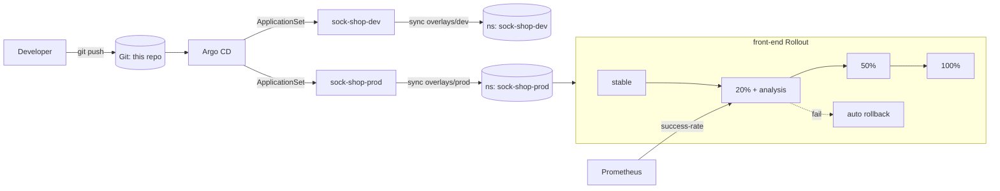

# 03 · GitOps Delivery of Sock Shop with Argo CD + Argo Rollouts

The canonical **Sock Shop** microservices app delivered through a proper GitOps
workflow: Git is the source of truth, **Argo CD** auto-syncs and self-heals, and
the front-end ships via an **Argo Rollouts canary** that **automatically rolls
back** when its success-rate analysis fails. Promotion flows dev → prod through
Kustomize overlays.

> **Inspiration & credit:** [`microservices-demo/microservices-demo`](https://github.com/microservices-demo/microservices-demo)
> (Sock Shop, the Weaveworks cloud-native reference app). This is an independent
> GitOps rebuild — Kustomize base/overlays, an Argo CD `ApplicationSet`, and a
> canary Rollout with automated rollback (the "make it your own" upgrade).

## Architecture



## Layout

```
apps/
  base/                 Sock Shop services (front-end as a canary Rollout)
  overlays/dev          namespace sock-shop-dev, 1 replica
  overlays/prod         namespace sock-shop-prod, 2 replicas
argocd/
  project.yaml          AppProject guardrails (allowed repo/namespaces)
  applicationset.yaml   generates sock-shop-dev + sock-shop-prod Applications
```

## GitOps workflow

1. **Bootstrap** (once): install Argo CD + Argo Rollouts, then apply the project
   and ApplicationSet.
   ```bash
   kubectl create namespace argocd
   kubectl apply -n argocd -f https://raw.githubusercontent.com/argoproj/argo-cd/stable/manifests/install.yaml
   kubectl create namespace argo-rollouts
   kubectl apply -n argo-rollouts -f https://github.com/argoproj/argo-rollouts/releases/latest/download/install.yaml
   kubectl apply -f argocd/project.yaml
   kubectl apply -f argocd/applicationset.yaml
   ```
2. **Auto-sync & self-heal:** Argo CD reconciles both environments. Edit a live
   object (`kubectl scale ...`) and watch it revert — drift correction.
3. **Promotion (dev → prod):** make a change under `apps/base` or `overlays/dev`,
   verify in `sock-shop-dev`, then promote the same change to prod (it lands in
   `overlays/prod` / base) — one Git change, reconciled by Argo CD.
4. **Canary + rollback:** bump the `front-end` image. The Rollout shifts 20% of
   traffic, runs the `success-rate` AnalysisTemplate against Prometheus, and only
   proceeds if ≥95% success — otherwise it **aborts and reverts to stable**.
   ```bash
   kubectl argo rollouts get rollout front-end -n sock-shop-prod --watch
   ```

## Validation

CI (`.github/workflows/sockshop.yml`) renders both overlays with Kustomize and
validates them with `kubeconform` (core resources against Kubernetes schemas, and
the Argo CD / Argo Rollouts CRDs against the datreeio CRDs-catalog). Run locally:

```bash
kubectl kustomize apps/overlays/prod | kubeconform -strict -ignore-missing-schemas -
```

## Teardown / cost safety

```bash
kind delete cluster --name sockshop      # 100% local — no cloud spend
```
