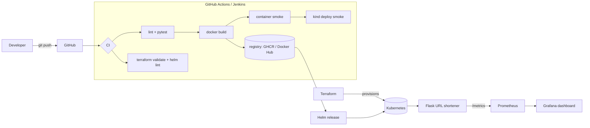

# 05 · Flask App Production Pipeline (CI/CD + Terraform + Kubernetes)

A real Python **Flask URL-shortener** taken from source to a running, monitored
Kubernetes deployment — with CI (build → lint → test → image → scan), Terraform
for the cluster, a Helm chart, and Prometheus/Grafana monitoring.

> **Inspiration & credit:** the classic Jenkins + Docker Hub + Terraform + K8s
> flow demonstrated by [`srinanpravij/capterraform`](https://github.com/srinanpravij/capterraform).
> This is an independent rebuild on a different app, with added tests, Prometheus
> metrics, a Helm chart, a kind-based smoke test, **and a GitHub Actions pipeline
> alongside the Jenkinsfile** (the "make it your own" upgrade).

## Architecture



## The app

| Route | Purpose |
|-------|---------|
| `GET /` | HTML form to shorten a URL |
| `POST /api/shorten` | `{"url": "..."}` → `{"code", "short_url"}` |
| `GET /<code>` | 302 redirect to the original URL |
| `GET /healthz` | liveness/readiness probe |
| `GET /metrics` | Prometheus metrics (`urlshort_*`) |

The store is in-memory (single replica by design); a production deploy would
back it with Redis/Postgres.

## Run it locally

### App only
```bash
cd app
python -m venv .venv && source .venv/bin/activate
pip install -r requirements-dev.txt
pytest -q                       # tests
python app.py                   # http://localhost:8000
```

### Full stack on kind (Terraform + Helm)
```bash
# Option A — provision the cluster with Terraform (kind provider)
cd terraform && terraform init && terraform apply
# Option B — or just use the helper script (kind CLI + Helm):
./scripts/kind-up.sh
kubectl port-forward svc/us-urlshortener 8000:80   # http://localhost:8000
```

## CI/CD

- **Primary:** `.github/workflows/flask.yml` — four jobs: `test` (flake8 + pytest),
  `image` (build + container smoke), `iac` (`terraform validate` + `helm lint` +
  `kubeconform`), and `deploy-smoke` (spins up **kind**, loads the image, `helm
  install`, and curls the live app end-to-end).
- **Alternative:** [`ci/Jenkinsfile`](./ci/Jenkinsfile) — the same flow for a
  Jenkins server (run Jenkins locally via Docker, add a `dockerhub` credential).

## Cloud variant (AWS EKS)

The Terraform here uses the **kind provider** so it applies for free locally. The
module shape (a cluster resource whose outputs feed Helm) maps directly onto a
managed cluster — swap in
[`terraform-aws-modules/eks/aws`](https://registry.terraform.io/modules/terraform-aws-modules/eks/aws)
+ `vpc/aws`, point a `helm` provider at the cluster, and the chart deploys
unchanged. Monitoring becomes the `kube-prometheus-stack` chart, and the
`ServiceMonitor` (`serviceMonitor.enabled=true`) wires the app into Prometheus.

## Monitoring

`monitoring/grafana-dashboard.json` is an importable dashboard (request rate, p95
latency, shorten/redirect totals) driven by the app's `/metrics`.

## Teardown / cost safety

```bash
# kind
kind delete cluster --name flask-cicd
# or, if provisioned via Terraform
cd terraform && terraform destroy
```

This project is **100% local** (kind) — it costs nothing. The optional AWS
variant is the only part that incurs spend; destroy the EKS stack with
`terraform destroy` when done.
