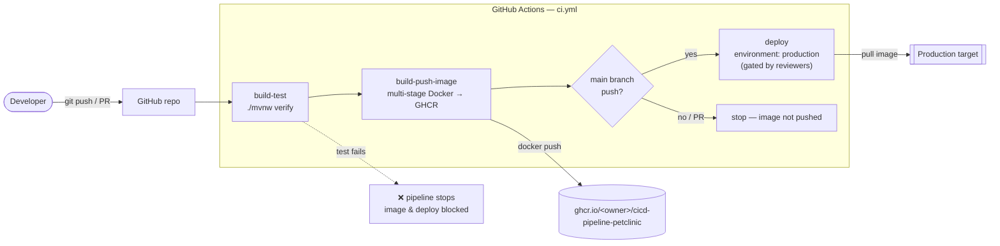

# cicd-pipeline-petclinic

[](https://github.com/mbongowo/cicd-pipeline-petclinic/actions/workflows/ci.yml)

A production-style **CI/CD pipeline** wrapped around the real
[Spring PetClinic](https://github.com/spring-projects/spring-petclinic) application.
Every push is built and tested, packaged into a minimal multi-stage Docker image,
published to the **GitHub Container Registry (GHCR)**, and rolled out through a
**gated `production` deployment** — with a documented rollback path.

> This repo is a derivative of `spring-projects/spring-petclinic` (Apache-2.0).
> The application source is unchanged; this project adds the `Dockerfile`,
> the GitHub Actions pipeline, and this documentation. See [License](#license).

---

## Architecture



**Pipeline stages**

| Job | Runs on | What it does | Gate |
|-----|---------|--------------|------|
| `build-test` | push + PR | `./mvnw verify` — compiles and runs the full PetClinic test suite | A failing test fails the job and blocks everything downstream |
| `build-push-image` | push + PR | Builds the multi-stage image; pushes to GHCR (PRs build only, no push) | `needs: build-test` |
| `deploy` | push to `main` only | Deploys the published image | `needs: build-push-image` **and** `environment: production` (add required reviewers for a manual approval gate) |

---

## Prerequisites

| Tool | Why | Local validation only? |
|------|-----|------------------------|
| [Docker](https://docs.docker.com/get-docker/) | build/run the image locally | yes — CI builds on GitHub runners |
| [JDK 17](https://adoptium.net/) (Temurin) | run `./mvnw verify` locally | yes |
| `git`, [`gh`](https://cli.github.com/) | clone / push | — |

The repo bundles the Maven wrapper (`./mvnw`), so a separate Maven install is optional.

---

## Run it locally

### Option A — Build & run the container (self-contained, H2 database)

```bash
# Build the multi-stage image
docker build -t petclinic:local .

# Run it (in-memory H2 DB, no external services needed)
docker run --rm -p 8080:8080 petclinic:local
```

Open <http://localhost:8080>. Health: <http://localhost:8080/actuator/health>.

### Option B — Run from source with the Maven wrapper

```bash
./mvnw spring-boot:run        # macOS/Linux/WSL
# .\mvnw.cmd spring-boot:run  # Windows PowerShell
```

### Option C — Pull the published image from GHCR

```bash
docker pull ghcr.io/mbongowo/cicd-pipeline-petclinic:latest
docker run --rm -p 8080:8080 ghcr.io/mbongowo/cicd-pipeline-petclinic:latest
```

Configuration (database profile, JVM opts) is documented in [`.env.example`](.env.example).

---

## CI/CD — how the pipeline works

The workflow lives in [`.github/workflows/ci.yml`](.github/workflows/ci.yml).

### Authentication to GHCR (no secret to leak)

Pushing to **this repo's** GHCR namespace uses the **built-in `GITHUB_TOKEN`** with
`permissions: packages: write`. There is **nothing to configure and no secret to
create** for the default flow.

> **If you instead push to an external registry or another org**, create a Personal
> Access Token (scope `write:packages`) and store it as a repo secret, then swap the
> login step's `password:` to `${{ secrets.GHCR_PAT }}`:
>
> ```bash
> # Set the secret WITHOUT echoing a value into shell history or git:
> gh secret set GHCR_PAT --repo mbongowo/cicd-pipeline-petclinic
> # (gh prompts for the value interactively)
> ```
>
> No token value is ever committed — see [Security](#security).

### The `production` gate

The `deploy` job declares `environment: production`. To turn this into a real
approval gate:

1. Repo **Settings → Environments → New environment → `production`**.
2. Add **Required reviewers** (yourself).
3. Now every deploy waits for manual approval, and the image is already published
   and immutable by digest before anyone approves.

### Proving a failing test blocks deploy

`deploy` and `build-push-image` both `needs:` `build-test`. Break a test
(e.g. change an assertion in `src/test/.../OwnerControllerTests.java`), push, and the
pipeline stops at `build-test` — the image is never pushed and `deploy` is skipped.
Revert to go green again.

---

## Rollback

Images are tagged by **immutable commit SHA** (`sha-<full-sha>`) as well as `latest`.
To roll back, redeploy a previous SHA — never rebuild.

```bash
# List published versions
gh api /users/mbongowo/packages/container/cicd-pipeline-petclinic/versions \
  --jq '.[].metadata.container.tags'

# Roll back the deployment target to a known-good SHA, e.g.:
kubectl set image deployment/petclinic \
  petclinic=ghcr.io/mbongowo/cicd-pipeline-petclinic:sha-<previous-good-sha>
# or, for Azure App Service:
az webapp config container set --name <app> --resource-group <rg> \
  --docker-custom-image-name ghcr.io/mbongowo/cicd-pipeline-petclinic:sha-<previous-good-sha>
```

Because the SHA tag is immutable, a rollback is deterministic and auditable.

---

## Teardown & cost safety

This project costs **nothing** by default:

- **GitHub Actions** — free minutes on public repos.
- **GHCR** — free storage for public images.

Cleanup if you want to:

```bash
# Delete old container image versions (keeps the repo)
gh api -X DELETE /users/mbongowo/packages/container/cicd-pipeline-petclinic/versions/<id>

# Remove local images
docker image rm petclinic:local ghcr.io/mbongowo/cicd-pipeline-petclinic:latest
```

No cloud resources are provisioned by this repo; the `deploy` job is a documented
placeholder until you wire it to a real target.

---

## Security

- **No secrets in git.** The default pipeline uses the ephemeral `GITHUB_TOKEN`.
- `.env` is git-ignored; only `.env.example` (placeholders) is committed.
- The runtime image runs as a **non-root** user and ships a JRE-only layer.

---

## License

The PetClinic application is licensed under the **Apache License 2.0** by the
Spring team — see [`LICENSE.txt`](LICENSE.txt). The pipeline additions in this repo
(`Dockerfile`, `.github/`, docs) are released under the same Apache-2.0 license to
keep the derivative work consistent.
